# Fizjo-Planer

<div align="center">
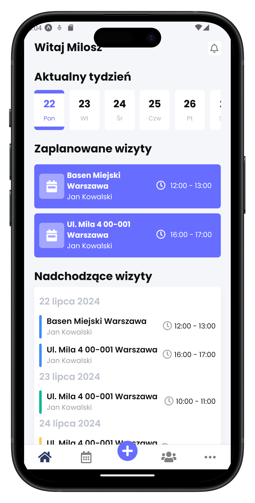
</div>

Fizjo-Planer is an application developed as part of my engineering thesis. It's designed specifically for mobile physiotherapists, providing quick access to appointments and patient data. Built using React Native, the app is available for both Android and iOS devices. It utilizes SQLite for offline functionality, so there's no need for an internet connection.

## Application Features:

- Welcome Screen: Provides an overview of the app's key features and functionalities.
- Pin Code and Biometric Login: Allows you to set or change your PIN code and supports biometric login for enhanced security.
- Appointment Management: Easily manage appointments for individual patients, with the option to schedule multiple visits at once.
- Patient Management: Keep track of patient information, their issues, and addresses where they can be reached.
- Automated SMS Reminders: Sends automatic SMS reminders to patients about upcoming visits.
- Google Maps Navigation: Navigate to specific appointments using Google Maps integration.
- Automated Reminders: Receive notifications one hour before each appointment.
- Theme Customization: Switch between light and dark mode themes for personalized user experience.
- Data Export/Import: Export and import the database to transfer data between devices seamlessly.

## Installation and Setup

A step by step series of examples that tell you how to get a development
environment running

- Clone the repository:

```

git clone https://github.com/milosz1532/fizjo-planer.git

```

- Navigate to the project directory:

```

cd fizjo-planer

```

- Install dependencies:

```

npm install

```

- Start the development server:

```

npm start

```

* Run on a Physical Device or Emulator:

  - On a Physical Device: Scan the QR code displayed in the Expo Developer Tools using the Expo Go app (available on the App Store and Google Play).

  - On an Emulator: Follow the instructions in the Expo Developer Tools to run the app on an Android or iOS emulator.


## Technologies Used:

- React Native
- Expo
- SQLite
- React Navigation

[](https://skillicons.dev)

## Application Screenshots:

<div align="center">
  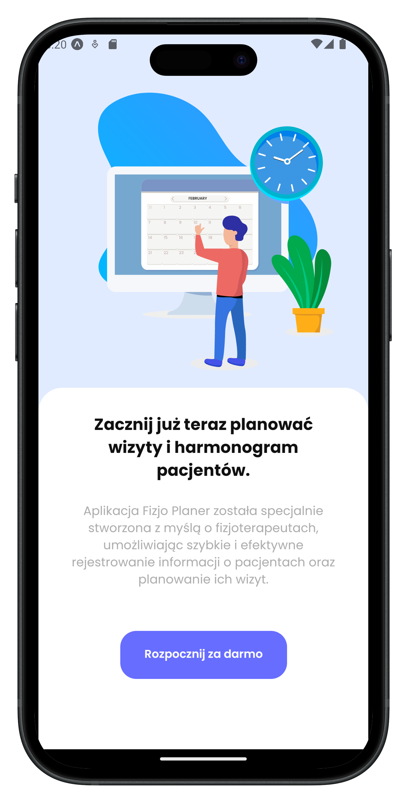
  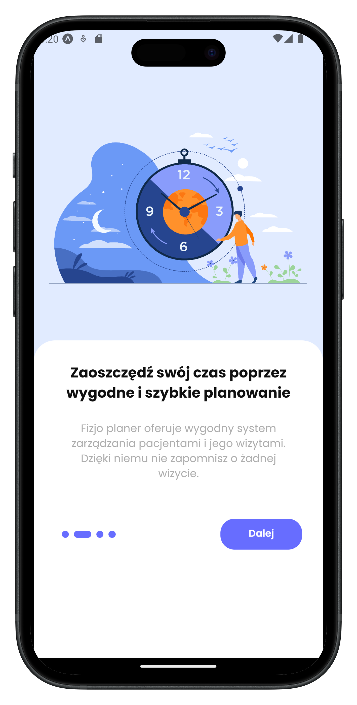
  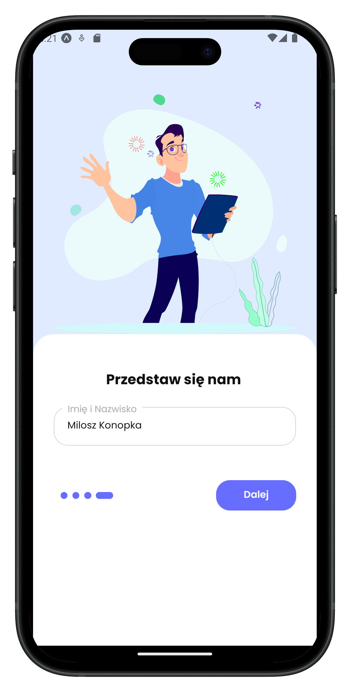
</div>

<div align="center">
  
  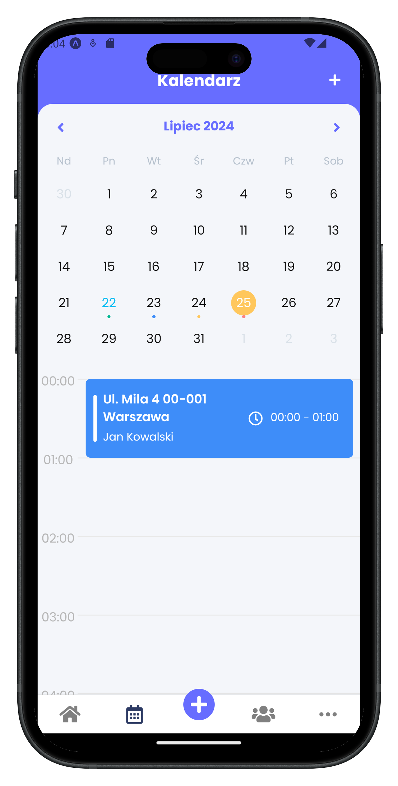
  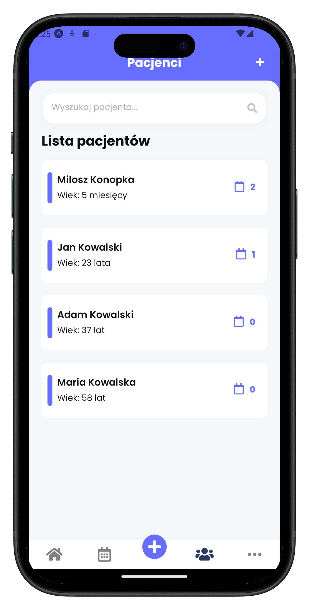
</div>

<div align="center">
  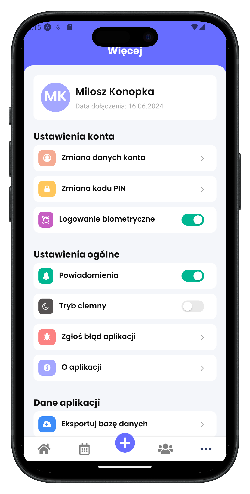
  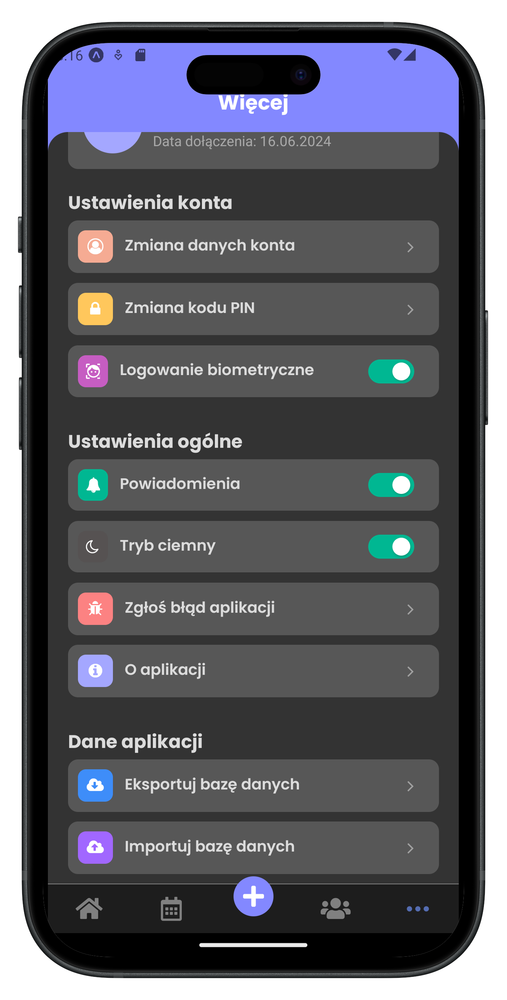
  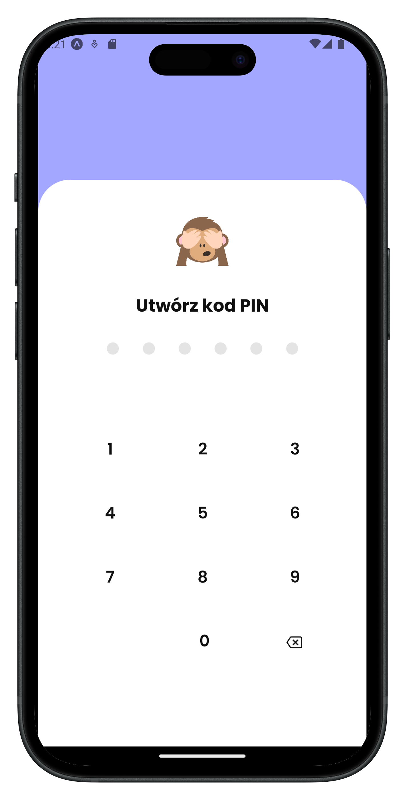
</div>

<div align="center">
  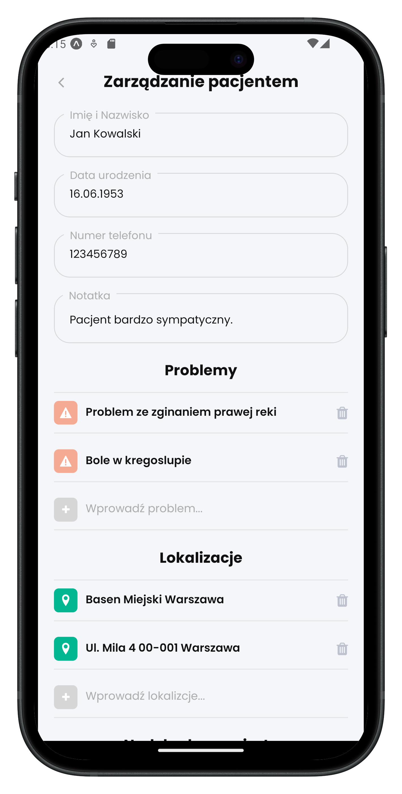
  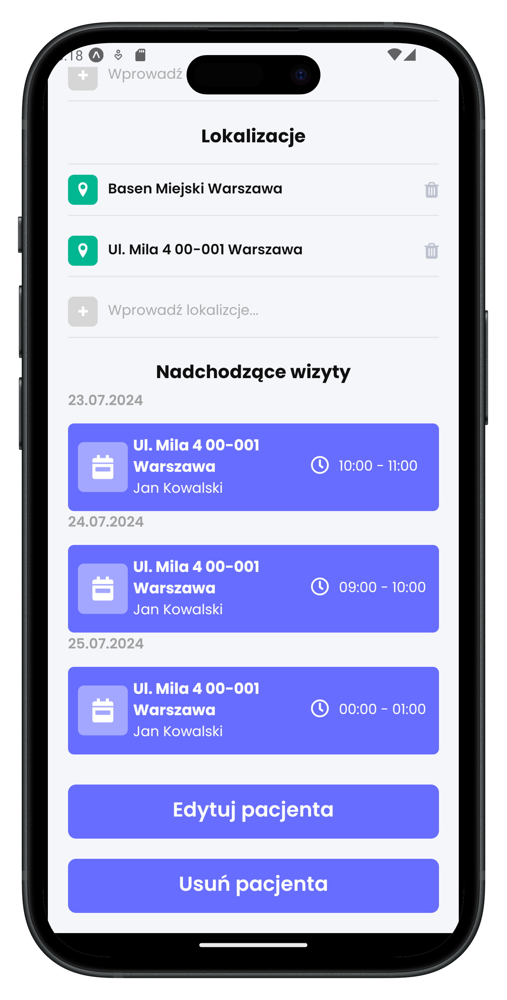
  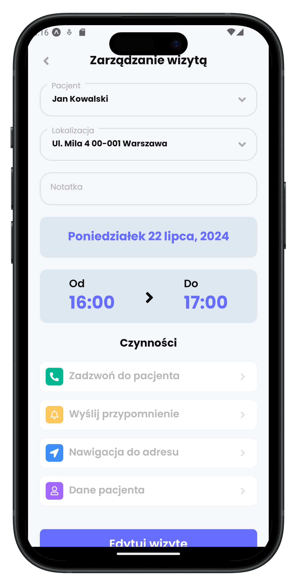
</div>


